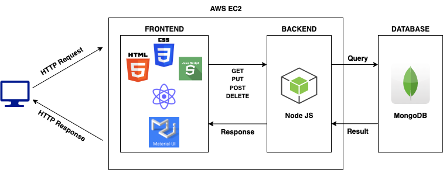
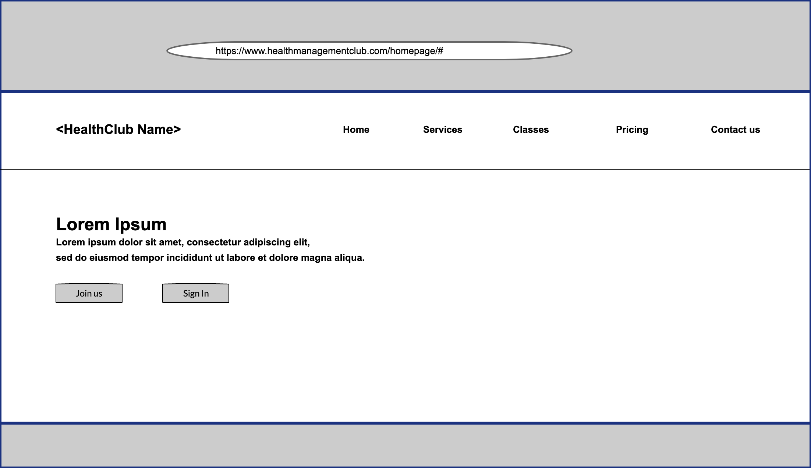
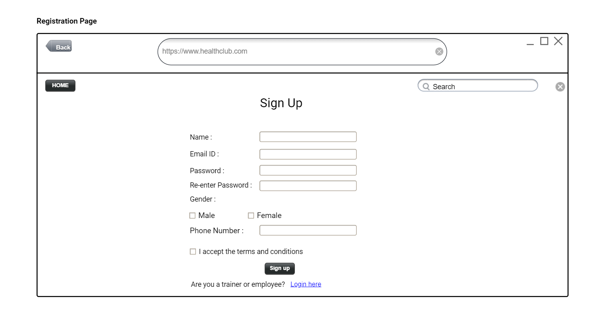
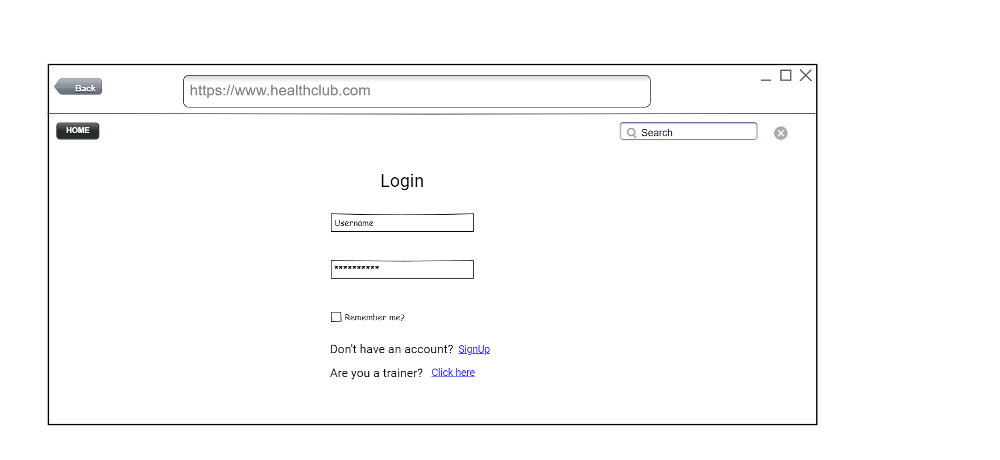
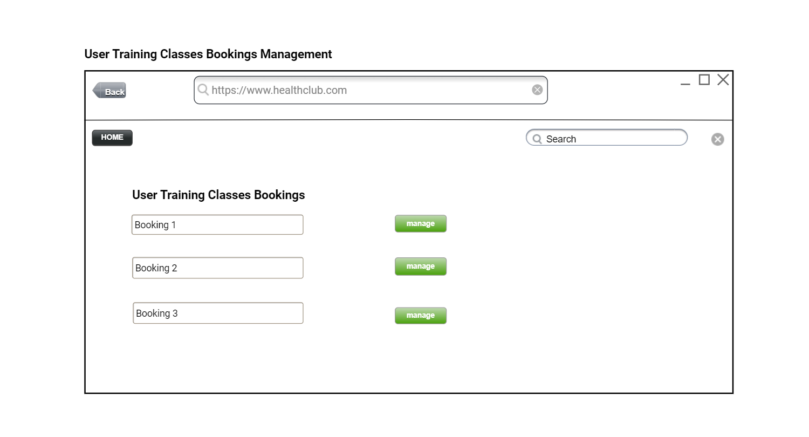
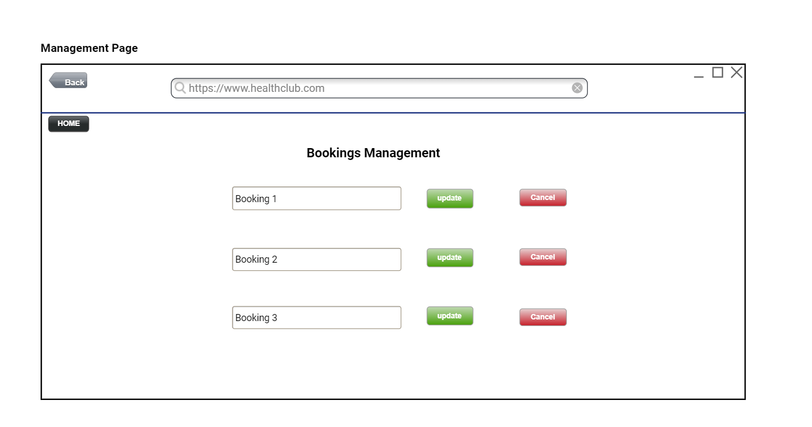

# Team Two0owT - HealthClub Membership Management

# Team Members:
1. Alekhya Pasupuleti (016622372)
2. Pavan Sai Chennam (016596814)
3. Pavan Satyam (016422172)
4. Piyush Gade (016420898)

# Tools Used:
• Frontend: React JS 
• Backend: NodeJS  
• Database: MongoDB 
• REST API: Postman (for testing developed APIs) 
• Cloud: Amazon Web Services (AWS) EC2 Cluster  

# Sprint length: 2 Weeks  

# Schedule for Scrum Meetings: 
• Monday 
• Wednesday  

# Task Allocations:
• Frontend: Pavan Sai Ch, Pavan Satyam  
• Backend: Alekhya, Pavan Sai Ch  
• Integration of Frontend and Backend: Pavan Satyam and Piyush 
• Deployment: Pavan Sai Ch, Pavan Satyam  
• Documentation: Piyush, Alekhya  

# XP Core Values:
• Communication  
• Courage  
• Simplicity  
• Feedback  

# Project Board
Project Board is available [here](https://github.com/gopinathsjsu/team-project-team-two0owt/projects?query=is%3Aopen)

# Sprint Sheet
Below is the link to Sprint sheet along with the Burndown charts. 

[Sprint Sheet](https://docs.google.com/spreadsheets/d/15ESOcwAWS9KTMRUC7-Spi8IHdli4D_klHfBFUR8EXy4/edit?usp=sharing)

# Architecture Diagram

# UI Wireframes
• Home Page  

• Registration Page  

• Login Page  

• Training Class Management Page  

• Manage Bookings Page  
